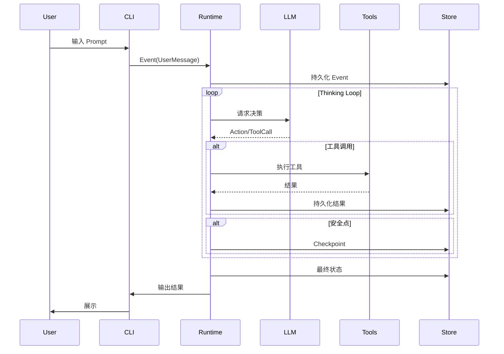

# 系统架构概览

> gm-agent 的整体架构设计

---

## 系统全景图

```
                   ┌─────────────── UI Shell ────────────────┐
Events             │ CLI / TUI / HTTP API / IDE Extension     │
(user/fs/timer) ──►└───────────────┬─────────────────────────┘
                                   │
                                   v
                        ┌────────────────────────┐
                        │   Go Runtime (Core)     │
                        │ Reducer + Dispatcher    │
                        │ Scheduler + Locks       │
                        │ Checkpoint + Recovery   │
                        └───────┬─────────┬──────┘
                                │ jobs     │ prompts
                                v          v
                     ┌────────────────┐  ┌──────────────────┐
                     │ Tool Executors │  │ LLM Gateway       │
                     │ shell/file/web │  │ OpenAI/Claude/... │
                     └───────┬────────┘  └─────────┬────────┘
                             │ artifacts/logs        │ responses
                             v                       v
                      ┌──────────────────────────────────┐
                      │ Storage + Trace + Artifacts      │
                      │ FS(JSONL+snapshot) / SQLite      │
                      └──────────────────────────────────┘

Ext: MCP / WASM plugins (可选)
```

---

## 核心组件

### 1. UI Shell (输入层)

| 组件 | 描述 |
| :--- | :--- |
| CLI | 命令行界面，主要交互方式 |
| TUI | 终端 UI (可选) |
| HTTP API | RESTful API (Phase 4) |
| Triggers | 文件监听/定时器/Webhook |

### 2. Go Runtime (核心层)

| 模块 | 职责 | 文档 |
| :--- | :--- | :--- |
| **Reducer** | 状态转换: `(state, event) -> (state, commands)` | [详情](./system-design.md#reducer) |
| **Dispatcher** | 执行 Commands (LLM 调用、工具调用) | [详情](./system-design.md#dispatcher) |
| **Scheduler** | Worker Pool + 并发控制 | [详情](./system-design.md#scheduler) |
| **Checkpoint** | 安全点 + 恢复 | [详情](./system-design.md#checkpoint) |

### 3. 工具层

| 模块 | 职责 | 文档 |
| :--- | :--- | :--- |
| **Tool Registry** | 工具注册与发现 | [详情](../03-modules/tool.md) |
| **Policy Gate** | allow/deny/ask 权限控制 | [详情](../03-modules/tool.md#policy) |
| **Executors** | 隔离执行环境 | [详情](../03-modules/tool.md#executor) |

### 4. LLM 层

| 模块 | 职责 | 文档 |
| :--- | :--- | :--- |
| **LLM Gateway** | 统一 LLM 调用接口 | [详情](../03-modules/llm.md) |
| **Provider Adapter** | 多模型适配 | [详情](../03-modules/llm.md#adapter) |
| **Token Budget** | Token 预算管理 | [详情](../03-modules/llm.md#budget) |

### 5. 存储层

| 模块 | 职责 | 文档 |
| :--- | :--- | :--- |
| **Event Store** | 事件日志 (append-only) | [详情](../03-modules/store.md) |
| **State Snapshot** | 状态快照 | [详情](../03-modules/store.md#snapshot) |
| **Artifacts** | 产物管理 | [详情](../03-modules/store.md#artifacts) |

---

## 数据流



---

## 技术选型

| 层次 | 技术 | 理由 |
| :--- | :--- | :--- |
| **语言** | Go | 并发原语、部署简单、性能好 |
| **LLM SDK** | 自研适配层 | 统一多模型接口 |
| **存储 (MVP)** | JSONL + FS | 无依赖、Debug 友好 |
| **存储 (升级)** | SQLite | 事务、索引、并发 |
| **扩展** | MCP | 社区生态复用 |

---

## 目录结构

```
gm-agent/
├── cmd/gm/              # CLI 入口
│   └── main.go
├── pkg/
│   ├── runtime/         # 核心 Runtime
│   │   ├── reducer.go
│   │   ├── dispatcher.go
│   │   ├── scheduler.go
│   │   └── checkpoint.go
│   ├── agent/           # Agent 抽象
│   │   ├── main.go
│   │   └── sub.go
│   ├── tool/            # 工具系统
│   │   ├── registry.go
│   │   ├── executor.go
│   │   └── policy.go
│   ├── llm/             # LLM 适配
│   │   ├── gateway.go
│   │   ├── openai/
│   │   └── anthropic/
│   ├── patch/           # Patch Engine
│   │   ├── diff.go
│   │   └── apply.go
│   ├── store/           # 存储层
│   │   ├── event.go
│   │   ├── snapshot.go
│   │   └── fs/
│   ├── skill/           # Skill 系统
│   │   └── registry.go
│   └── scheme/          # Scheme 解释器
│       └── interpreter.go
├── skills/              # 内置 Skills
├── schemes/             # 内置 Schemes
└── docs/                # 文档
```

---

## 下一步

- [系统设计详解](./system-design.md) - 核心设计决策
- [数据模型](./data-model.md) - 核心数据结构
