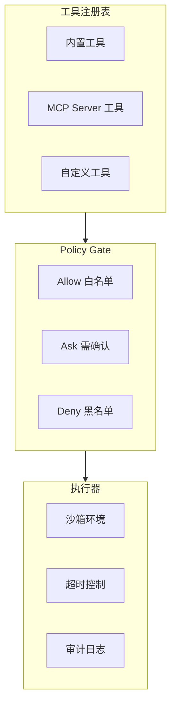

# 模块设计: Tool (工具系统)

> 工具注册、权限控制、执行隔离

---

## 1. 概述

Tool 模块负责：
- 工具的注册与发现
- 权限策略控制 (Policy Gate)
- 安全隔离执行

> **数据类型定义**: 见 [data-model.md](../02-architecture/data-model.md)

---

## 2. 架构



---

## 3. 核心接口

### 3.1 Tool Registry

```go
// ToolRegistry 工具注册表
type ToolRegistry interface {
    // 注册工具
    Register(tool ToolDefinition) error
    
    // 获取工具
    Get(name string) (ToolDefinition, bool)
    
    // 列出所有工具
    List() []ToolDefinition
    
    // 列出工具定义（用于 LLM）
    ListForLLM() []Tool
}

// ToolDefinition 工具完整定义
type ToolDefinition struct {
    // 基础信息
    Name        string     `json:"name"`
    Description string     `json:"description"`
    Parameters  JSONSchema `json:"parameters"`
    
    // 执行器
    Handler     ToolHandler `json:"-"`
    
    // 元数据
    Category    string   `json:"category"`
    Tags        []string `json:"tags"`
    Version     string   `json:"version"`
    
    // 约束
    DefaultTimeout time.Duration `json:"default_timeout"`
    MaxOutputSize  int           `json:"max_output_size"`
}

// ToolHandler 工具执行函数
type ToolHandler func(ctx context.Context, args map[string]any) (*ToolOutput, error)

// ToolOutput 工具输出
type ToolOutput struct {
    Content  string `json:"content"`
    IsError  bool   `json:"is_error"`
    Metadata map[string]any `json:"metadata,omitempty"`
}
```

### 3.2 Policy Gate

```go
// PolicyGate 策略门
type PolicyGate interface {
    // 检查是否允许执行
    Check(ctx context.Context, req *ToolRequest) (PolicyDecision, error)
    
    // 请求用户确认
    RequestApproval(ctx context.Context, req *ToolRequest) (bool, error)
}

type ToolRequest struct {
    ToolName   string         `json:"tool_name"`
    Arguments  map[string]any `json:"arguments"`
    RequestID  string         `json:"request_id"`
    GoalID     string         `json:"goal_id"`
}

type PolicyDecision struct {
    Action  PolicyAction `json:"action"`
    Reason  string       `json:"reason"`
    Timeout time.Duration `json:"timeout,omitempty"`
}

type PolicyAction string
const (
    PolicyAllow PolicyAction = "allow"  // 直接执行
    PolicyAsk   PolicyAction = "ask"    // 需要用户确认
    PolicyDeny  PolicyAction = "deny"   // 拒绝执行
)
```

### 3.3 Tool Executor

```go
// ToolExecutor 工具执行器
type ToolExecutor interface {
    // 执行工具（同步）
    Execute(ctx context.Context, call *ToolCall) (*ToolResult, error)
}

// 实现
type executor struct {
    registry ToolRegistry
    gate     PolicyGate
    audit    AuditLogger
    config   ExecutorConfig
}

func (e *executor) Execute(ctx context.Context, call *ToolCall) (*ToolResult, error) {
    // 1. 获取工具定义
    tool, ok := e.registry.Get(call.Name)
    if !ok {
        return nil, &ToolNotFoundError{Name: call.Name}
    }
    
    // 2. 解析参数
    args, err := parseArguments(call.Arguments, tool.Parameters)
    if err != nil {
        return nil, &ArgumentParseError{Cause: err}
    }
    
    // 3. 策略检查
    req := &ToolRequest{
        ToolName:  call.Name,
        Arguments: args,
        RequestID: call.ID,
    }
    
    decision, err := e.gate.Check(ctx, req)
    if err != nil {
        return nil, err
    }
    
    switch decision.Action {
    case PolicyDeny:
        e.audit.Log(ctx, AuditEvent{
            Type:     AuditPolicyDenied,
            Action:   call.Name,
            Resource: fmt.Sprintf("%v", args),
            Result:   "denied",
        })
        return nil, &PolicyDeniedError{Reason: decision.Reason}
        
    case PolicyAsk:
        approved, err := e.gate.RequestApproval(ctx, req)
        if err != nil || !approved {
            return nil, &ApprovalDeniedError{}
        }
    }
    
    // 4. 设置超时
    timeout := tool.DefaultTimeout
    if decision.Timeout > 0 {
        timeout = decision.Timeout
    }
    execCtx, cancel := context.WithTimeout(ctx, timeout)
    defer cancel()
    
    // 5. 执行
    start := time.Now()
    output, err := tool.Handler(execCtx, args)
    duration := time.Since(start)
    
    // 6. 审计
    e.audit.Log(ctx, AuditEvent{
        Type:     AuditToolExecuted,
        Action:   call.Name,
        Result:   resultStatus(err),
        Metadata: map[string]any{
            "duration_ms": duration.Milliseconds(),
        },
    })
    
    if err != nil {
        return &ToolResult{
            ToolCallID: call.ID,
            Content:    err.Error(),
            IsError:    true,
        }, nil  // 返回错误作为结果，不是执行失败
    }
    
    return &ToolResult{
        ToolCallID: call.ID,
        Content:    output.Content,
        IsError:    output.IsError,
    }, nil
}
```

---

## 4. 内置工具

### 4.1 read_file

```go
var ReadFileTool = ToolDefinition{
    Name:        "read_file",
    Description: "读取文件内容",
    Parameters: JSONSchema{
        "type": "object",
        "properties": map[string]any{
            "path": map[string]any{
                "type":        "string",
                "description": "文件路径",
            },
            "start_line": map[string]any{
                "type":        "integer",
                "description": "起始行号（可选，1-indexed）",
            },
            "end_line": map[string]any{
                "type":        "integer",
                "description": "结束行号（可选）",
            },
        },
        "required": []string{"path"},
    },
    Handler:        readFileHandler,
    DefaultTimeout: 10 * time.Second,
    MaxOutputSize:  1024 * 1024, // 1MB
}

func readFileHandler(ctx context.Context, args map[string]any) (*ToolOutput, error) {
    path := args["path"].(string)
    
    // 路径检查（由 Policy Gate 完成，这里做最终验证）
    if !isPathAllowed(path) {
        return nil, &PathNotAllowedError{Path: path}
    }
    
    content, err := os.ReadFile(path)
    if err != nil {
        return &ToolOutput{
            Content: fmt.Sprintf("Error reading file: %v", err),
            IsError: true,
        }, nil
    }
    
    // 行范围截取
    lines := strings.Split(string(content), "\n")
    startLine, _ := args["start_line"].(int)
    endLine, _ := args["end_line"].(int)
    
    if startLine > 0 || endLine > 0 {
        lines = sliceLines(lines, startLine, endLine)
    }
    
    return &ToolOutput{
        Content: strings.Join(lines, "\n"),
    }, nil
}
```

### 4.2 run_shell

```go
var RunShellTool = ToolDefinition{
    Name:        "run_shell",
    Description: "执行 Shell 命令",
    Parameters: JSONSchema{
        "type": "object",
        "properties": map[string]any{
            "command": map[string]any{
                "type":        "string",
                "description": "要执行的命令",
            },
            "cwd": map[string]any{
                "type":        "string",
                "description": "工作目录（可选）",
            },
        },
        "required": []string{"command"},
    },
    Handler:        runShellHandler,
    DefaultTimeout: 60 * time.Second,
    MaxOutputSize:  10 * 1024 * 1024, // 10MB
}

func runShellHandler(ctx context.Context, args map[string]any) (*ToolOutput, error) {
    command := args["command"].(string)
    cwd, _ := args["cwd"].(string)
    
    // 命令注入防护
    if containsDangerousChars(command) {
        return &ToolOutput{
            Content: "Command contains dangerous characters",
            IsError: true,
        }, nil
    }
    
    // 执行
    cmd := exec.CommandContext(ctx, "sh", "-c", command)
    if cwd != "" {
        cmd.Dir = cwd
    }
    
    output, err := cmd.CombinedOutput()
    if err != nil {
        var exitErr *exec.ExitError
        if errors.As(err, &exitErr) {
            return &ToolOutput{
                Content: fmt.Sprintf("Exit code: %d\n%s", exitErr.ExitCode(), string(output)),
                IsError: true,
            }, nil
        }
        return nil, err
    }
    
    return &ToolOutput{
        Content: string(output),
    }, nil
}
```

### 4.3 search_files

```go
var SearchFilesTool = ToolDefinition{
    Name:        "search_files",
    Description: "搜索文件内容",
    Parameters: JSONSchema{
        "type": "object",
        "properties": map[string]any{
            "pattern": map[string]any{
                "type":        "string",
                "description": "搜索模式（支持正则）",
            },
            "path": map[string]any{
                "type":        "string",
                "description": "搜索路径（默认当前目录）",
            },
            "file_pattern": map[string]any{
                "type":        "string",
                "description": "文件名过滤（glob 格式）",
            },
        },
        "required": []string{"pattern"},
    },
    Handler:        searchFilesHandler,
    DefaultTimeout: 30 * time.Second,
    MaxOutputSize:  1024 * 1024,
}
```

---

## 5. 策略配置

```yaml
# policy.yaml
tools:
  # 默认策略
  default: ask
  
  # 工具级别策略
  read_file:
    action: allow
    constraints:
      max_size: 10MB
      allowed_paths:
        - "./"
        - "/tmp/"
      denied_paths:
        - "~/.ssh/*"
        - "**/*.pem"
        - "**/*.key"
  
  run_shell:
    action: ask
    whitelist:
      - "ls *"
      - "cat *"
      - "grep *"
      - "git status"
      - "git diff *"
      - "go build *"
      - "go test *"
    blacklist:
      - "rm -rf *"
      - "sudo *"
      - "chmod 777 *"
    
  search_files:
    action: allow
    constraints:
      max_results: 100
```

---

## 6. 目录结构

```
pkg/tool/
├── registry.go     # 工具注册表
├── executor.go     # 执行器
├── policy.go       # 策略门
├── builtin/
│   ├── read_file.go
│   ├── write_file.go
│   ├── search_files.go
│   ├── run_shell.go
│   └── list_files.go
├── mcp/
│   └── client.go   # MCP 客户端
└── testing/
    └── mock.go
```

---

## 7. 已知限制

1. **MCP 工具需要外部 Server**: MCP 工具通过 stdio/SSE 连接外部进程，需要用户自行启动。

2. **Shell 命令白名单是模糊匹配**: `ls *` 只检查命令开头，复杂命令可能绕过。

3. **文件大小限制是软限制**: 超大文件会被截断而不是拒绝，可能丢失信息。
