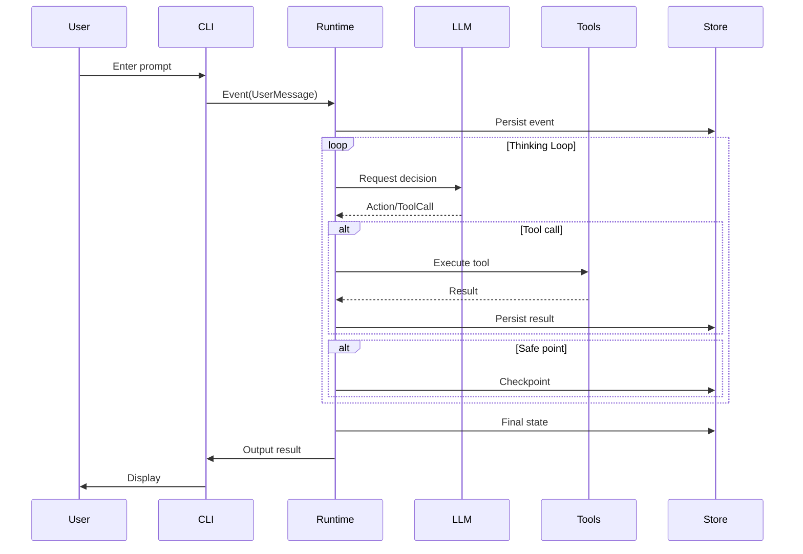

# Architecture Overview

> End-to-end view of gm-agent's design

---

## System Landscape

```
                   ┌─────────────── UI Shell ────────────────┐
Events             │ CLI / TUI / HTTP API / IDE Extension     │
(user/fs/timer) ──►└───────────────┬─────────────────────────┘
                                   │
                                   v
                        ┌────────────────────────┐
                        │   Go Runtime (Core)     │
                        │ Reducer + Dispatcher    │
                        │ Scheduler + Locks       │
                        │ Checkpoint + Recovery   │
                        └───────┬─────────┬──────┘
                                │ jobs     │ prompts
                                v          v
                     ┌────────────────┐  ┌──────────────────┐
                     │ Tool Executors │  │ LLM Gateway       │
                     │ shell/file/web │  │ OpenAI/Claude/... │
                     └───────┬────────┘  └─────────┬────────┘
                             │ artifacts/logs        │ responses
                             v                       v
                      ┌──────────────────────────────────┐
                      │ Storage + Trace + Artifacts      │
                      │ FS(JSONL+snapshot) / SQLite      │
                      └──────────────────────────────────┘

Ext: MCP / WASM plugins (optional)
```

---

## Core Components

### 1. UI Shell (Input)

| Component | Description |
| :--- | :--- |
| CLI | Primary command-line interaction |
| TUI | Optional terminal UI |
| HTTP API | RESTful interface (Phase 4) |
| Triggers | File watcher / timer / webhook |

### 2. Go Runtime (Core)

| Module | Responsibility | Docs |
| :--- | :--- | :--- |
| **Reducer** | State transform `(state, event) -> (state, commands)` | [Details](./system-design.md#reducer) |
| **Dispatcher** | Execute commands (LLM, tools) | [Details](./system-design.md#dispatcher) |
| **Scheduler** | Worker pool and concurrency | [Details](./system-design.md#scheduler) |
| **Checkpoint** | Safe points and recovery | [Details](./system-design.md#checkpoint) |

### 3. Tooling Layer

| Module | Responsibility | Docs |
| :--- | :--- | :--- |
| **Tool Registry** | Register and discover tools | [Details](../03-modules/tool.md) |
| **Policy Gate** | allow/deny/ask permission control | [Details](../03-modules/tool.md#policy) |
| **Executors** | Isolated execution environments | [Details](../03-modules/tool.md#executor) |

### 4. LLM Layer

| Module | Responsibility | Docs |
| :--- | :--- | :--- |
| **LLM Gateway** | Unified LLM calling surface | [Details](../03-modules/llm.md) |
| **Provider Adapter** | Multi-model adapters | [Details](../03-modules/llm.md#adapter) |
| **Token Budget** | Context budgeting | [Details](../03-modules/llm.md#budget) |

### 5. Storage Layer

| Module | Responsibility | Docs |
| :--- | :--- | :--- |
| **Event Store** | Append-only event log | [Details](../03-modules/store.md) |
| **State Snapshot** | Snapshotting runtime state | [Details](../03-modules/store.md#snapshot) |
| **Artifacts** | Artifact management | [Details](../03-modules/store.md#artifacts) |

---

## Data Flow



---

## Tech Choices

| Layer | Tech | Reason |
| :--- | :--- | :--- |
| **Language** | Go | Great concurrency, simple deploy, strong performance |
| **LLM SDK** | Custom adapter | Unified multi-model interface |
| **Storage (MVP)** | JSONL + FS | Zero dependency, easy debugging |
| **Storage (upgrade)** | SQLite | Transactions, indexes, concurrency |
| **Extensions** | MCP | Reuse community ecosystem |

---

## Directory Layout

```
gm-agent/
├── cmd/gm/              # CLI entrypoint
│   └── main.go
├── pkg/
│   ├── runtime/         # Core runtime
│   │   ├── reducer.go
│   │   ├── dispatcher.go
│   │   ├── scheduler.go
│   │   └── checkpoint.go
│   ├── agent/           # Agent abstraction
│   │   ├── main.go
│   │   └── sub.go
│   ├── tool/            # Tooling
│   │   ├── registry.go
│   │   ├── executor.go
│   │   └── policy.go
│   ├── llm/             # LLM adapters
│   │   ├── gateway.go
│   │   ├── openai/
│   │   └── anthropic/
│   ├── patch/           # Patch engine
│   │   ├── diff.go
│   │   └── apply.go
│   ├── store/           # Storage layer
│   │   ├── event.go
│   │   ├── snapshot.go
│   │   └── fs/
│   ├── skill/           # Skill system
│   │   └── registry.go
│   └── scheme/          # Scheme interpreter
│       └── interpreter.go
├── skills/              # Built-in skills
├── schemes/             # Built-in schemes
└── docs/                # Documentation
```

---

## Next Steps

- [System Design Details](./system-design.md) - Core design decisions
- [Data Model](./data-model.md) - Key data structures
