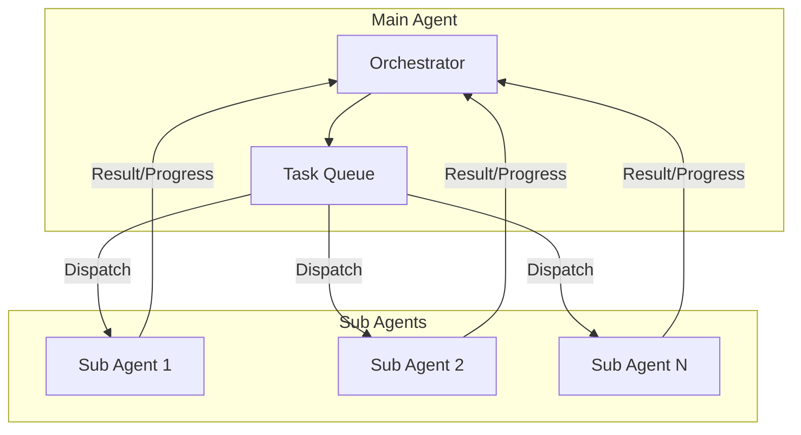

# 模块设计: Agent

> Main Agent 与 Sub Agent 的协作协议

---

## 1. 概述

gm-agent 支持**层级式多 Agent 架构**：
- **Main Agent (Orchestrator)**: 拆解任务、调度、治理、汇总
- **Sub Agent (Worker)**: 执行具体子任务，输出结构化结果

> ⚠️ **MVP 阶段**：仅实现单 Main Agent + 同步 Sub Agent 调用。异步并行 Sub Agent 在 Phase 2 实现。

---

## 2. 架构



---

## 3. Task Protocol

### 3.1 Task 结构（派发）

> Task/TaskConstraints/TaskResult 定义见 [data-model.md](../02-architecture/data-model.md)。

```go
// Task/TaskConstraints 定义见 data-model.md
task := &Task{
    ID:          GenerateTaskID(),
    GoalID:      goal.ID,
    ParentID:    parentID,
    Type:        "analysis",
    Description: "分析并输出结构化结论",
    Inputs:      map[string]any{"doc_id": "doc_123"},
    Constraints: TaskConstraints{
        MaxSteps:     20,
        MaxTokens:    8000,
        Timeout:      2 * time.Minute,
        AllowedTools: []string{"read_file", "search_files"},
        PolicyLevel:  "ask",
    },
}
```

### 3.2 SubAgentReport 结构（返回）

> TaskResult 定义见 [data-model.md](../02-architecture/data-model.md)。

```go
// SubAgentReport 是子 Agent 的返回报告（非持久化模型）
// TaskResult 定义见 data-model.md
type SubAgentReport struct {
    TaskID    string      `json:"task_id"`
    Result    *TaskResult `json:"result"`
    Evidence  []Evidence  `json:"evidence,omitempty"`
    NextTasks []TaskSuggestion `json:"next_tasks,omitempty"`
}

type Evidence struct {
    Source  string `json:"source"`
    Detail  string `json:"detail"`
}

type TaskSuggestion struct {
    Type        string         `json:"type"`
    Description string         `json:"description"`
    Inputs      map[string]any `json:"inputs,omitempty"`
}
```

### 3.3 Progress 结构（进度上报）

```go
// Progress 是 Sub Agent 的中间进度上报
type Progress struct {
    TaskID    string    `json:"task_id"`
    Timestamp time.Time `json:"timestamp"`
    
    // 进度
    Step      int     `json:"step"`       // 当前步数
    TotalEst  int     `json:"total_est"`  // 预估总步数
    Percent   float64 `json:"percent"`    // 完成百分比
    
    // 当前状态
    CurrentAction string `json:"current_action"` // 当前动作描述
    
    // 健康状态
    IsBlocked bool   `json:"is_blocked"`          // 是否阻塞
    BlockedOn string `json:"blocked_on,omitempty"` // 阻塞原因
}
```

---

## 4. 通信机制

### 4.1 同步调用（MVP）

```go
// SubAgentExecutor 子 Agent 执行器
type SubAgentExecutor interface {
    // 同步执行子任务
    Execute(ctx context.Context, task *Task) (*SubAgentReport, error)
}

// 实现
type LocalSubAgent struct {
    runtime *Runtime
    config  SubAgentConfig
}

func (a *LocalSubAgent) Execute(ctx context.Context, task *Task) (*SubAgentReport, error) {
    // 1. 创建子 Runtime (隔离状态)
    subRuntime := NewRuntime(RuntimeConfig{
        MaxSteps: task.Constraints.MaxSteps,
    })
    
    // 2. 设置超时
    ctx, cancel := context.WithTimeout(ctx, task.Constraints.Timeout)
    defer cancel()
    
    // 3. 执行
    err := subRuntime.Run(ctx)
    
    // 4. 收集结果
    return &SubAgentReport{
        TaskID: task.ID,
        Result: &TaskResult{
            Status:    determineStatus(err),
            Summary:   subRuntime.GetSummary(),
            Artifacts: subRuntime.GetArtifacts(),
            Stats:     subRuntime.GetStats(),
        },
    }, nil
}
```

### 4.2 异步调用（Phase 2）

```go
// AsyncSubAgentExecutor 异步子 Agent 执行器
type AsyncSubAgentExecutor interface {
    // 派发任务，返回句柄
    Dispatch(ctx context.Context, task *Task) (TaskHandle, error)
}

// TaskHandle 任务句柄
type TaskHandle interface {
    ID() string
    
    // 状态订阅
    Status() <-chan SubTaskStatus
    Progress() <-chan Progress
    
    // 获取结果 (阻塞)
    Wait(ctx context.Context) (*SubAgentReport, error)
    
    // 取消
    Cancel() error
}

type SubTaskStatus string
const (
    SubTaskStatusPending  SubTaskStatus = "pending"
    SubTaskStatusRunning  SubTaskStatus = "running"
    SubTaskStatusBlocked  SubTaskStatus = "blocked"
    SubTaskStatusDone     SubTaskStatus = "done"
    SubTaskStatusFailed   SubTaskStatus = "failed"
)
```

---

## 5. 超时与取消

### 5.1 超时检测

```go
func (a *LocalSubAgent) Execute(ctx context.Context, task *Task) (*SubAgentReport, error) {
    // 设置任务级超时
    taskCtx, cancel := context.WithTimeout(ctx, task.Constraints.Timeout)
    defer cancel()
    
    // 启动心跳检测
    heartbeat := make(chan struct{})
    go func() {
        ticker := time.NewTicker(5 * time.Second)
        defer ticker.Stop()
        for {
            select {
            case <-ticker.C:
                select {
                case heartbeat <- struct{}{}:
                default:
                }
            case <-taskCtx.Done():
                return
            }
        }
    }()
    
    // 执行任务
    resultCh := make(chan *SubAgentReport, 1)
    errCh := make(chan error, 1)
    go func() {
        result, err := a.doExecute(taskCtx, task)
        if err != nil {
            errCh <- err
        } else {
            resultCh <- result
        }
    }()
    
    // 等待结果或超时
    select {
    case result := <-resultCh:
        return result, nil
    case err := <-errCh:
        return nil, err
    case <-taskCtx.Done():
        return &SubAgentReport{
            TaskID: task.ID,
            Result: &TaskResult{
                Status: "timeout",
                Error: &TaskError{
                    Code:    "TIMEOUT",
                    Message: fmt.Sprintf("task exceeded timeout: %v", task.Constraints.Timeout),
                },
            },
        }, nil
    }
}
```

### 5.2 取消传播

```go
// Main Agent 取消任务
func (o *Orchestrator) CancelTask(taskID string) error {
    handle, ok := o.runningTasks[taskID]
    if !ok {
        return ErrTaskNotFound
    }
    
    // 发送取消信号
    if err := handle.Cancel(); err != nil {
        return err
    }
    
    // 等待清理完成 (带超时)
    ctx, cancel := context.WithTimeout(context.Background(), 10*time.Second)
    defer cancel()
    
    result, err := handle.Wait(ctx)
    if err != nil {
        o.log.Warn("task cancel wait failed", "task_id", taskID, "error", err)
    }
    
    // 记录取消事件
    o.events <- &TaskCancelledEvent{
        TaskID: taskID,
        Result: result,
    }
    
    return nil
}
```

---

## 6. 隔离策略

### 6.1 状态隔离

```go
// Sub Agent 有独立的状态，不污染 Main Agent
func NewSubAgentRuntime(parent *Runtime, task *Task) *Runtime {
    return &Runtime{
        // 独立状态
        state: NewState(),
        
        // 共享只读资源
        store:  parent.store,  // 共享存储
        llm:    parent.llm,    // 共享 LLM 连接
        
        // 独立配置
        config: RuntimeConfig{
            MaxSteps: task.Constraints.MaxSteps,
        },
        
        // 限制工具权限
        tools: filterTools(parent.tools, task.Constraints.AllowedTools),
    }
}
```

### 6.2 资源限制

| 资源 | Main Agent | Sub Agent |
| :--- | :--- | :--- |
| MaxSteps | 100 (默认) | 由任务指定 |
| MaxTokens | 无限制 | 由任务指定 |
| 工具权限 | 完整 | 子集 |
| 文件访问 | 项目根目录 | 任务指定目录 |
| 写入权限 | 完整 | 可能只读 |

---

## 7. Sub Agent 之间的通信

### 7.1 设计决策

> ⚠️ **MVP 阶段不支持 Sub Agent 之间直接通信。**

所有通信必须经过 Main Agent：

```
❌ Sub Agent A --> Sub Agent B  (禁止)
✅ Sub Agent A --> Main Agent --> Sub Agent B  (允许)
```

**理由**：
1. 简化系统复杂度
2. Main Agent 可以做权限控制
3. 便于审计和调试

### 7.2 数据共享

Sub Agent 可以通过 Artifacts 共享数据：

```go
// Sub Agent A 产出 Artifact
result := &SubAgentReport{
    TaskID: "task_123",
    Result: &TaskResult{
        Artifacts: []string{"analysis_result"},
    },
}

// Main Agent 传递给 Sub Agent B
taskB := &Task{
    Inputs: map[string]any{
        "analysis_artifact_id": "analysis_result",
    },
}
```

---

## 8. 已知限制

1. **单进程限制**：当前 Sub Agent 都在同一进程内运行。分布式 Sub Agent 需要 Phase 3 实现。

2. **同步阻塞**：MVP 阶段 Sub Agent 调用是同步的，Main Agent 会等待。并行执行在 Phase 2 实现。

3. **无 Sub Agent 间通信**：所有通信必须经过 Main Agent。

4. **共享 LLM 配额**：所有 Sub Agent 共享同一个 LLM 配额，无法单独限制。

---

## 9. 迭代计划

| Phase | 功能 |
| :---: | :--- |
| **1 (MVP)** | 同步 Sub Agent 调用，单进程 |
| **2** | 异步并行 Sub Agent，进度上报，取消传播 |
| **3** | 分布式 Sub Agent (gRPC/HTTP) |
| **4** | Sub Agent 动态伸缩，负载均衡 |
