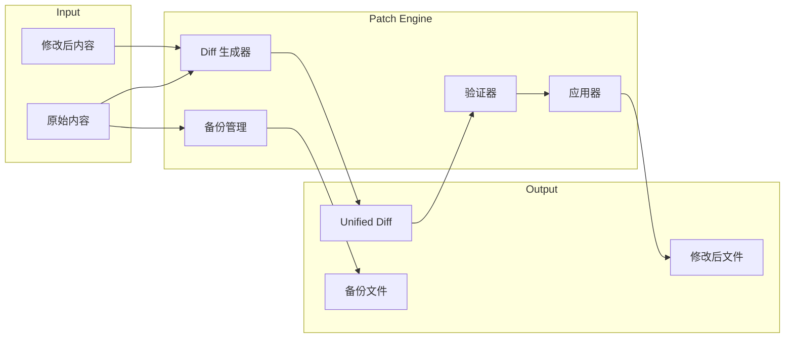

# 模块设计: Patch Engine

> 文件 Diff 生成、应用与回滚

---

## 1. 概述

Patch Engine 负责：
- 生成 unified diff 格式的补丁
- 安全应用补丁（支持 dry-run）
- 备份与回滚

> **数据类型定义**: 见 [data-model.md](../02-architecture/data-model.md)

---

## 2. 架构



---

## 3. 核心接口

```go
// PatchEngine 补丁引擎接口
type PatchEngine interface {
    // 生成 diff
    GenerateDiff(ctx context.Context, req *DiffRequest) (*Patch, error)
    
    // 应用补丁（dry-run）
    DryRun(ctx context.Context, patch *Patch) (*ApplyResult, error)
    
    // 应用补丁（实际执行）
    Apply(ctx context.Context, patch *Patch) (*ApplyResult, error)
    
    // 回滚
    Rollback(ctx context.Context, patchID string) error
    
    // 列出可回滚的补丁
    ListRollbacks(ctx context.Context) ([]PatchInfo, error)
}

// DiffRequest diff 请求
type DiffRequest struct {
    FilePath     string `json:"file_path"`
    OriginalPath string `json:"original_path,omitempty"` // 可选，默认读取 FilePath
    NewContent   string `json:"new_content"`
    
    // 选项
    ContextLines int  `json:"context_lines"` // 上下文行数，默认 3
    IgnoreWhitespace bool `json:"ignore_whitespace"`
}

// Patch 补丁结构
type Patch struct {
    ID        string    `json:"id"`
    FilePath  string    `json:"file_path"`
    Diff      string    `json:"diff"`      // Unified diff 格式
    CreatedAt time.Time `json:"created_at"`
    
    // 元数据
    LinesAdded   int `json:"lines_added"`
    LinesRemoved int `json:"lines_removed"`
    Hunks        int `json:"hunks"`
}

// ApplyResult 应用结果
type ApplyResult struct {
    Success   bool     `json:"success"`
    FilePath  string   `json:"file_path"`
    BackupID  string   `json:"backup_id,omitempty"`
    
    // 冲突信息
    Conflicts []Conflict `json:"conflicts,omitempty"`
    
    // 偏移信息
    LineOffset int `json:"line_offset"` // 实际应用时的行号偏移
}

type Conflict struct {
    Hunk     int    `json:"hunk"`
    Expected string `json:"expected"`
    Actual   string `json:"actual"`
    Line     int    `json:"line"`
}
```

---

## 4. 实现

### 4.1 Diff 生成

```go
func (e *engine) GenerateDiff(ctx context.Context, req *DiffRequest) (*Patch, error) {
    // 1. 读取原始文件
    originalPath := req.OriginalPath
    if originalPath == "" {
        originalPath = req.FilePath
    }
    
    originalContent, err := os.ReadFile(originalPath)
    if err != nil && !os.IsNotExist(err) {
        return nil, fmt.Errorf("read original: %w", err)
    }
    
    // 2. 检测二进制文件
    if isBinary(originalContent) || isBinary([]byte(req.NewContent)) {
        return nil, &BinaryFileError{Path: req.FilePath}
    }
    
    // 3. 生成 diff
    diff := difflib.UnifiedDiff{
        A:        splitLines(string(originalContent)),
        B:        splitLines(req.NewContent),
        FromFile: "a/" + req.FilePath,
        ToFile:   "b/" + req.FilePath,
        Context:  req.ContextLines,
    }
    
    diffText, err := difflib.GetUnifiedDiffString(diff)
    if err != nil {
        return nil, fmt.Errorf("generate diff: %w", err)
    }
    
    // 4. 统计
    added, removed, hunks := countDiffStats(diffText)
    
    return &Patch{
        ID:           GeneratePatchID(),
        FilePath:     req.FilePath,
        Diff:         diffText,
        CreatedAt:    time.Now(),
        LinesAdded:   added,
        LinesRemoved: removed,
        Hunks:        hunks,
    }, nil
}

func isBinary(content []byte) bool {
    // 检测 NUL 字符
    for _, b := range content[:min(len(content), 8000)] {
        if b == 0 {
            return true
        }
    }
    return false
}
```

### 4.2 Dry-run

```go
func (e *engine) DryRun(ctx context.Context, patch *Patch) (*ApplyResult, error) {
    // 1. 读取当前文件
    currentContent, err := os.ReadFile(patch.FilePath)
    if err != nil && !os.IsNotExist(err) {
        return nil, fmt.Errorf("read file: %w", err)
    }
    
    // 2. 解析 patch
    hunks, err := parsePatch(patch.Diff)
    if err != nil {
        return nil, fmt.Errorf("parse patch: %w", err)
    }
    
    // 3. 尝试应用（不写入）
    result, conflicts, offset := tryApply(string(currentContent), hunks)
    if len(conflicts) > 0 {
        return &ApplyResult{
            Success:   false,
            FilePath:  patch.FilePath,
            Conflicts: conflicts,
        }, nil
    }
    
    return &ApplyResult{
        Success:    true,
        FilePath:   patch.FilePath,
        LineOffset: offset,
    }, nil
}
```

### 4.3 Apply

```go
func (e *engine) Apply(ctx context.Context, patch *Patch) (*ApplyResult, error) {
    // 1. 先 dry-run
    dryResult, err := e.DryRun(ctx, patch)
    if err != nil {
        return nil, err
    }
    if !dryResult.Success {
        return dryResult, nil
    }
    
    // 2. 备份原文件
    backupID, err := e.backup.Create(patch.FilePath)
    if err != nil {
        return nil, fmt.Errorf("backup: %w", err)
    }
    
    // 3. 读取当前内容
    currentContent, _ := os.ReadFile(patch.FilePath)
    
    // 4. 应用补丁
    hunks, _ := parsePatch(patch.Diff)
    newContent, _, _ := tryApply(string(currentContent), hunks)
    
    // 5. 原子写入
    tmpPath := patch.FilePath + ".tmp"
    if err := os.WriteFile(tmpPath, []byte(newContent), 0644); err != nil {
        return nil, fmt.Errorf("write temp: %w", err)
    }
    
    if err := os.Rename(tmpPath, patch.FilePath); err != nil {
        os.Remove(tmpPath)
        return nil, fmt.Errorf("rename: %w", err)
    }
    
    // 6. 记录应用信息
    e.applied[patch.ID] = &AppliedPatch{
        Patch:    patch,
        BackupID: backupID,
        AppliedAt: time.Now(),
    }
    
    return &ApplyResult{
        Success:    true,
        FilePath:   patch.FilePath,
        BackupID:   backupID,
        LineOffset: dryResult.LineOffset,
    }, nil
}
```

### 4.4 Rollback

```go
func (e *engine) Rollback(ctx context.Context, patchID string) error {
    // 1. 查找应用记录
    applied, ok := e.applied[patchID]
    if !ok {
        return &PatchNotFoundError{ID: patchID}
    }
    
    // 2. 恢复备份
    if err := e.backup.Restore(applied.BackupID, applied.Patch.FilePath); err != nil {
        return fmt.Errorf("restore backup: %w", err)
    }
    
    // 3. 清理记录
    delete(e.applied, patchID)
    
    return nil
}
```

---

## 5. 备份管理

```go
// BackupManager 备份管理器
type BackupManager interface {
    // 创建备份
    Create(filePath string) (backupID string, err error)
    
    // 恢复备份
    Restore(backupID string, targetPath string) error
    
    // 删除备份
    Delete(backupID string) error
    
    // 清理过期备份
    Cleanup(maxAge time.Duration) error
}

// 备份存储结构
// ~/.gm-agent/backups/
// ├── {backup_id}/
// │   ├── metadata.json
// │   └── content
```

---

## 6. 配置

```yaml
patch:
  # diff 生成
  context_lines: 3
  
  # 备份
  backup:
    enabled: true
    max_count: 100
    max_age: 24h
  
  # 冲突处理
  conflict:
    # abort: 遇到冲突立即失败
    # fuzzy: 尝试模糊匹配（允许 N 行偏移）
    mode: fuzzy
    max_offset: 10
```

---

## 7. 错误类型

```go
// BinaryFileError 二进制文件错误
type BinaryFileError struct {
    Path string
}

// PatchConflictError 补丁冲突错误
type PatchConflictError struct {
    Conflicts []Conflict
}

// PatchNotFoundError 补丁未找到
type PatchNotFoundError struct {
    ID string
}

// BackupNotFoundError 备份未找到
type BackupNotFoundError struct {
    ID string
}
```

---

## 8. 目录结构

```
pkg/patch/
├── engine.go       # PatchEngine 实现
├── diff.go         # Diff 生成
├── apply.go        # 应用逻辑
├── backup.go       # 备份管理
├── parse.go        # Patch 解析
└── testing/
    └── fixtures/   # 测试用例
```

---

## 9. 已知限制

1. **不支持二进制文件**: 检测到二进制内容会返回错误。

2. **备份是全量的**: 每次备份完整文件，大文件会占用空间。

3. **回滚只支持最近的应用**: 不支持跨多个 patch 的回滚链。

4. **行号偏移有上限**: 超过 max_offset 的偏移会被视为冲突。
