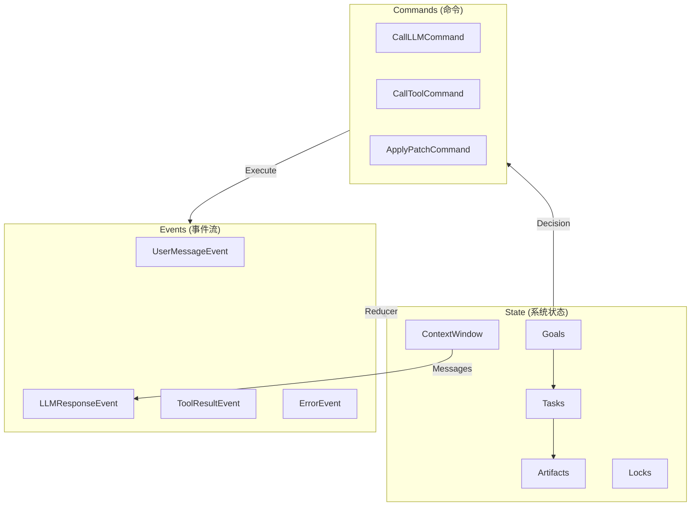

# 数据模型

> 核心数据结构的统一定义

---

## 1. 概述

本文档定义 gm-agent 的**规范数据模型**。所有模块必须遵循这些定义，不得自行扩展或修改字段。

> ⚠️ **这是唯一的数据模型权威来源**。其他文档中的代码示例如有冲突，以本文档为准。

---

## 2. 状态模型

### 2.1 State (系统状态)

```go
// State 是系统的完整状态快照
// Runtime 的所有决策都基于此状态
type State struct {
    // 版本控制
    Version   int64     `json:"version"`    // 状态版本号，每次更新递增
    UpdatedAt time.Time `json:"updated_at"` // 最后更新时间
    
    // 目标管理
    Goals     []Goal    `json:"goals"`      // 目标列表（按优先级排序）
    
    // 任务管理
    Tasks     map[string]*Task `json:"tasks"` // 任务表: task_id -> Task
    
    // 产物管理
    Artifacts map[string]*Artifact `json:"artifacts"` // 产物表: artifact_id -> Artifact
    
    // 资源锁
    Locks     map[string]*Lock `json:"locks"` // 资源锁表: resource_path -> Lock
    
    // 上下文窗口
    Context   *ContextWindow `json:"context"` // LLM 上下文
}

// Clone 深拷贝状态（用于 checkpoint）
func (s *State) Clone() *State {
    // 实现深拷贝...
}
```

### 2.2 Goal (目标)

```go
// Goal 表示一个待完成的目标
type Goal struct {
    ID          string     `json:"id"`           // 唯一 ID
    Type        GoalType   `json:"type"`         // 目标类型
    Description string     `json:"description"`  // 自然语言描述
    Priority    int        `json:"priority"`     // 优先级 (0 最高)
    Status      GoalStatus `json:"status"`       // 状态
    
    // 来源
    SourceEventID string   `json:"source_event_id"` // 创建此目标的事件 ID
    
    // 约束
    Deadline    *time.Time `json:"deadline,omitempty"` // 截止时间
    MaxSteps    int        `json:"max_steps"`          // 最大步数
    
    // 进度
    StepsUsed   int        `json:"steps_used"`   // 已使用步数
    
    // 时间戳
    CreatedAt   time.Time  `json:"created_at"`
    UpdatedAt   time.Time  `json:"updated_at"`
}

type GoalType string
const (
    GoalTypeUserRequest GoalType = "user_request"  // 用户请求
    GoalTypeSubTask     GoalType = "sub_task"      // 子任务
    GoalTypeRecovery    GoalType = "recovery"      // 错误恢复
)

type GoalStatus string
const (
    GoalStatusPending    GoalStatus = "pending"     // 待处理
    GoalStatusInProgress GoalStatus = "in_progress" // 进行中
    GoalStatusCompleted  GoalStatus = "completed"   // 已完成
    GoalStatusFailed     GoalStatus = "failed"      // 失败
    GoalStatusCancelled  GoalStatus = "cancelled"   // 已取消
)
```

### 2.3 Task (任务)

```go
// Task 表示一个执行中的任务（与 Goal 的区别：Task 是执行单元）
type Task struct {
    ID       string     `json:"id"`
    GoalID   string     `json:"goal_id"`   // 所属目标
    ParentID string     `json:"parent_id"` // 父任务 ID（如有）
    
    Type        string         `json:"type"`
    Description string         `json:"description"`
    Inputs      map[string]any `json:"inputs"`
    
    Status    TaskStatus `json:"status"`
    
    // 约束
    Constraints TaskConstraints `json:"constraints"`
    
    // 结果
    Result    *TaskResult `json:"result,omitempty"`
    
    // 时间戳
    CreatedAt time.Time `json:"created_at"`
    StartedAt *time.Time `json:"started_at,omitempty"`
    EndedAt   *time.Time `json:"ended_at,omitempty"`
}

type TaskStatus string
const (
    TaskStatusPending   TaskStatus = "pending"
    TaskStatusRunning   TaskStatus = "running"
    TaskStatusBlocked   TaskStatus = "blocked"
    TaskStatusCompleted TaskStatus = "completed"
    TaskStatusFailed    TaskStatus = "failed"
    TaskStatusCancelled TaskStatus = "cancelled"
)

type TaskConstraints struct {
    MaxSteps     int           `json:"max_steps"`
    MaxTokens    int           `json:"max_tokens"`
    Timeout      time.Duration `json:"timeout"`
    AllowedTools []string      `json:"allowed_tools"`
    PolicyLevel  string        `json:"policy_level"`
}

type TaskResult struct {
    Status    string         `json:"status"`
    Summary   string         `json:"summary"`
    Artifacts []string       `json:"artifacts"` // Artifact IDs
    Error     *TaskError     `json:"error,omitempty"`
    Stats     TaskStats      `json:"stats"`
}

type TaskError struct {
    Code    string `json:"code"`
    Message string `json:"message"`
    Details any    `json:"details,omitempty"`
}

type TaskStats struct {
    Steps      int           `json:"steps"`
    TokensUsed int           `json:"tokens_used"`
    ToolCalls  int           `json:"tool_calls"`
    Duration   time.Duration `json:"duration"`
}
```

### 2.4 ContextWindow (上下文窗口)

```go
// ContextWindow 管理 LLM 对话的上下文
type ContextWindow struct {
    // 消息列表
    Messages []Message `json:"messages"`
    
    // Token 统计
    TotalTokens int `json:"total_tokens"`
    
    // 配置
    MaxTokens     int `json:"max_tokens"`      // 最大 token 数
    ReserveOutput int `json:"reserve_output"`  // 为输出预留的 token
    
    // 压缩状态
    LastCompactionAt *time.Time `json:"last_compaction_at,omitempty"`
    CompactionCount  int        `json:"compaction_count"`
}

// Message 单条消息
type Message struct {
    ID        string    `json:"id"`
    Role      string    `json:"role"` // system/user/assistant/tool
    Content   string    `json:"content"`
    
    // 工具调用（assistant 消息）
    ToolCalls []ToolCall `json:"tool_calls,omitempty"`
    
    // 工具结果（tool 消息）
    ToolCallID string `json:"tool_call_id,omitempty"`
    
    // Token 估算
    TokenCount int `json:"token_count"`
    
    // 时间戳
    Timestamp time.Time `json:"timestamp"`
}
```

### 2.5 Lock (资源锁)

```go
// Lock 表示对资源的锁定
type Lock struct {
    Resource  string    `json:"resource"`   // 资源路径
    Owner     string    `json:"owner"`      // 持有者（task_id 或 goal_id）
    Type      LockType  `json:"type"`       // 锁类型
    AcquiredAt time.Time `json:"acquired_at"`
    ExpiresAt  time.Time `json:"expires_at"` // 锁超时时间
}

type LockType string
const (
    LockTypeRead  LockType = "read"
    LockTypeWrite LockType = "write"
)
```

---

## 3. 事件模型

### 3.1 Event (事件基类)

```go
// Event 是所有事件的接口
type Event interface {
    // 标识
    EventID() string          // 唯一 ID
    EventType() string        // 事件类型
    EventTimestamp() time.Time
    
    // 元数据
    EventActor() string       // 发起者
    EventSubject() string     // 作用域
}

// BaseEvent 事件基类（嵌入到具体事件中）
type BaseEvent struct {
    ID        string    `json:"id"`
    Type      string    `json:"type"`
    Timestamp time.Time `json:"timestamp"`
    Actor     string    `json:"actor"`
    Subject   string    `json:"subject"`
}

// 实现 Event 接口
func (e *BaseEvent) EventID() string          { return e.ID }
func (e *BaseEvent) EventType() string        { return e.Type }
func (e *BaseEvent) EventTimestamp() time.Time { return e.Timestamp }
func (e *BaseEvent) EventActor() string       { return e.Actor }
func (e *BaseEvent) EventSubject() string     { return e.Subject }

// NewBaseEvent 创建基础事件（自动生成 ID 和时间戳）
func NewBaseEvent(eventType, actor, subject string) BaseEvent {
    return BaseEvent{
        ID:        GenerateEventID(),
        Type:      eventType,
        Timestamp: time.Now(),
        Actor:     actor,
        Subject:   subject,
    }
}
```

### 3.2 具体事件类型

```go
// UserMessageEvent 用户消息事件
type UserMessageEvent struct {
    BaseEvent
    Content  string   `json:"content"`
    Priority int      `json:"priority"`
    Semantic Semantic `json:"semantic"` // append/fork/preempt/cancel
}

// LLMResponseEvent LLM 响应事件
type LLMResponseEvent struct {
    BaseEvent
    Model     string     `json:"model"`
    Content   string     `json:"content"`
    ToolCalls []ToolCall `json:"tool_calls,omitempty"`
    Usage     Usage      `json:"usage"`
}

// ToolResultEvent 工具执行结果事件
type ToolResultEvent struct {
    BaseEvent
    ToolCallID string `json:"tool_call_id"`
    ToolName   string `json:"tool_name"`
    Success    bool   `json:"success"`
    Output     string `json:"output"`
    Error      string `json:"error,omitempty"`
    Duration   int64  `json:"duration_ms"`
}

// ErrorEvent 错误事件
type ErrorEvent struct {
    BaseEvent
    CommandID string        `json:"command_id"`
    Error     string        `json:"error"`
    Severity  ErrorSeverity `json:"severity"`
}

// CheckpointEvent 检查点事件
type CheckpointEvent struct {
    BaseEvent
    CheckpointID string `json:"checkpoint_id"`
    StateVersion int64  `json:"state_version"`
}
```

---

## 4. 命令模型

### 4.1 Command (命令接口)

```go
// Command 是所有命令的接口
type Command interface {
    // 标识
    CommandID() string   // 唯一 ID
    CommandType() string // 命令类型
    
    // 执行
    Execute(ctx context.Context, deps CommandDeps) ([]Event, error)
}

// CommandDeps 命令执行时的依赖注入
type CommandDeps struct {
    LLM    LLMGateway
    Tools  ToolExecutor
    Store  Store
    Patch  PatchEngine
    Audit  AuditLogger
}

// BaseCommand 命令基类
type BaseCommand struct {
    ID   string `json:"id"`
    Type string `json:"type"`
}

func (c *BaseCommand) CommandID() string   { return c.ID }
func (c *BaseCommand) CommandType() string { return c.Type }

// NewBaseCommand 创建基础命令
func NewBaseCommand(cmdType string) BaseCommand {
    return BaseCommand{
        ID:   GenerateCommandID(),
        Type: cmdType,
    }
}
```

### 4.2 具体命令类型

```go
// CallLLMCommand 调用 LLM
type CallLLMCommand struct {
    BaseCommand
    Model    string    `json:"model"`
    Messages []Message `json:"messages"`
    Tools    []Tool    `json:"tools,omitempty"`
}

func (c *CallLLMCommand) Execute(ctx context.Context, deps CommandDeps) ([]Event, error) {
    resp, err := deps.LLM.Chat(ctx, &ChatRequest{
        Model:    c.Model,
        Messages: c.Messages,
        Tools:    c.Tools,
    })
    if err != nil {
        return []Event{&ErrorEvent{
            BaseEvent: NewBaseEvent("error", "system", "llm"),
            CommandID: c.ID,
            Error:     err.Error(),
            Severity:  ClassifyError(err),
        }}, err
    }
    
    return []Event{&LLMResponseEvent{
        BaseEvent: NewBaseEvent("llm_response", "llm", ""),
        Model:     resp.Model,
        Content:   resp.Content,
        ToolCalls: resp.ToolCalls,
        Usage:     resp.Usage,
    }}, nil
}

// CallToolCommand 调用工具
type CallToolCommand struct {
    BaseCommand
    ToolCallID string         `json:"tool_call_id,omitempty"`
    ToolName   string         `json:"tool_name"`
    Arguments  map[string]any `json:"arguments"`
}

// ApplyPatchCommand 应用补丁
type ApplyPatchCommand struct {
    BaseCommand
    FilePath string `json:"file_path"`
    Diff     string `json:"diff"`
    DryRun   bool   `json:"dry_run"`
}

// SaveCheckpointCommand 保存检查点
type SaveCheckpointCommand struct {
    BaseCommand
}
```

---

## 5. 存储模型

### 5.1 Checkpoint (检查点)

```go
// Checkpoint 检查点结构
// 用于崩溃恢复
type Checkpoint struct {
    ID           string    `json:"id"`            // 检查点 ID
    StateVersion int64     `json:"state_version"` // 对应的状态版本
    LastEventID  string    `json:"last_event_id"` // 最后处理的事件 ID
    Timestamp    time.Time `json:"timestamp"`     // 创建时间
    
    // 可选：嵌入状态（用于 FS Store 快速恢复）
    State        *State    `json:"state,omitempty"`
}
```

### 5.2 Artifact (产物)

```go
// Artifact 产物结构
type Artifact struct {
    ID        string            `json:"id"`
    Type      string            `json:"type"`      // file/json/text/image
    Name      string            `json:"name"`
    
    // 内容（二选一）
    Path      string            `json:"path,omitempty"`    // 文件路径
    Content   []byte            `json:"content,omitempty"` // 内联内容
    
    // 元数据
    Metadata  map[string]string `json:"metadata"`
    Size      int64             `json:"size"`
    
    // 关联
    TaskID    string            `json:"task_id,omitempty"`
    GoalID    string            `json:"goal_id,omitempty"`
    
    // 时间戳
    CreatedAt time.Time         `json:"created_at"`
}
```

---

## 6. Store 接口（规范）

```go
// Store 存储层完整接口
type Store interface {
    // 生命周期
    Open(ctx context.Context) error
    Close() error
    
    // 事件操作
    AppendEvent(ctx context.Context, event Event) error
    AppendEvents(ctx context.Context, events []Event) error
    GetEvent(ctx context.Context, id string) (Event, error)
    GetEventsSince(ctx context.Context, afterEventID string) ([]Event, error)
    IterEvents(ctx context.Context, fn func(Event) error) error
    
    // 状态操作
    SaveState(ctx context.Context, state *State) error
    LoadState(ctx context.Context, version int64) (*State, error)
    LoadLatestState(ctx context.Context) (*State, error)
    
    // 检查点操作
    SaveCheckpoint(ctx context.Context, cp *Checkpoint) error
    LoadCheckpoint(ctx context.Context, id string) (*Checkpoint, error)
    LoadLatestCheckpoint(ctx context.Context) (*Checkpoint, error)
    
    // 产物操作
    SaveArtifact(ctx context.Context, artifact *Artifact) error
    GetArtifact(ctx context.Context, id string) (*Artifact, error)
    ListArtifacts(ctx context.Context, filter ArtifactFilter) ([]Artifact, error)
    DeleteArtifact(ctx context.Context, id string) error
}

// Transactional 可选的事务接口
type Transactional interface {
    Begin(ctx context.Context) (Transaction, error)
}

type Transaction interface {
    Store
    Commit() error
    Rollback() error
}
```

---

## 7. 工具模型

### 7.1 Tool (工具定义)

```go
// Tool 工具定义
type Tool struct {
    Name        string     `json:"name"`
    Description string     `json:"description"`
    Parameters  JSONSchema `json:"parameters"` // JSON Schema
}

// ToolCall 工具调用
type ToolCall struct {
    ID        string `json:"id"`
    Name      string `json:"name"`
    Arguments string `json:"arguments"` // JSON 字符串
}

// ToolResult 工具执行结果
type ToolResult struct {
    ToolCallID string `json:"tool_call_id"`
    Content    string `json:"content"`
    IsError    bool   `json:"is_error"`
}
```

---

## 8. 辅助类型

```go
// Semantic 输入语义
type Semantic string
const (
    SemanticAppend  Semantic = "append"   // 追加到当前目标
    SemanticFork    Semantic = "fork"     // 新建独立目标
    SemanticPreempt Semantic = "preempt"  // 紧急抢占
    SemanticCancel  Semantic = "cancel"   // 取消任务
)

// ErrorSeverity 错误严重性
type ErrorSeverity string
const (
    SeverityRetryable   ErrorSeverity = "retryable"
    SeverityRecoverable ErrorSeverity = "recoverable"
    SeverityFatal       ErrorSeverity = "fatal"
)

// Usage Token 使用统计
type Usage struct {
    PromptTokens     int `json:"prompt_tokens"`
    CompletionTokens int `json:"completion_tokens"`
    TotalTokens      int `json:"total_tokens"`
}

// JSONSchema JSON Schema 定义
type JSONSchema map[string]any

// ID 生成
func GenerateEventID() string   { return "evt_" + ulid.Make().String() }
func GenerateCommandID() string { return "cmd_" + ulid.Make().String() }
func GenerateTaskID() string    { return "tsk_" + ulid.Make().String() }
func GenerateGoalID() string    { return "gol_" + ulid.Make().String() }
```

---

## 9. 类型关系图


