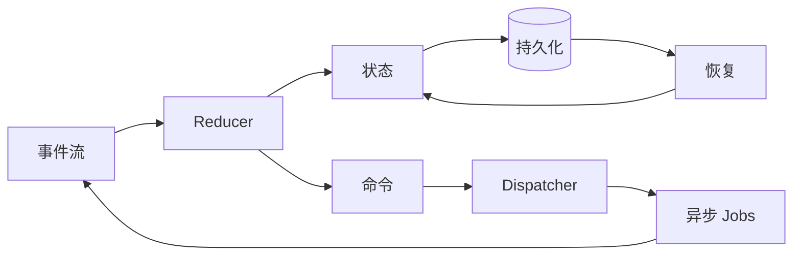
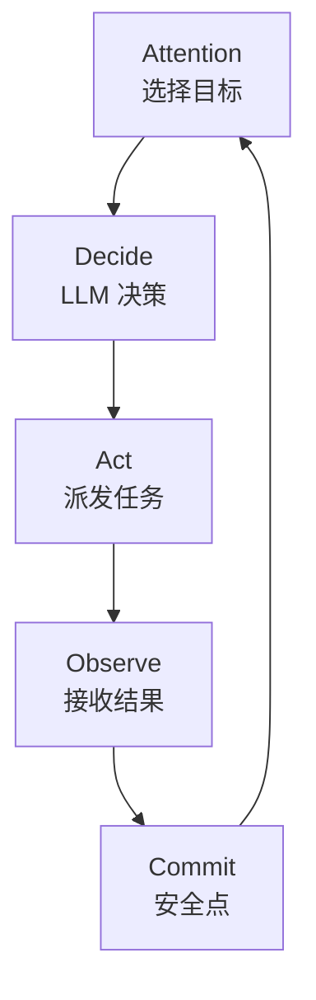
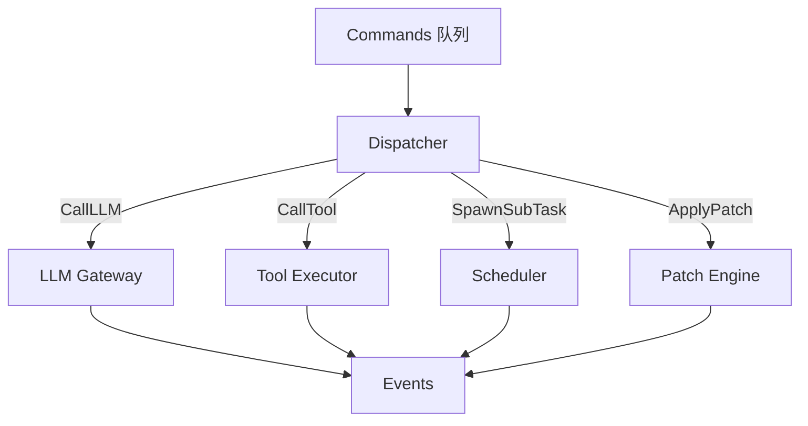
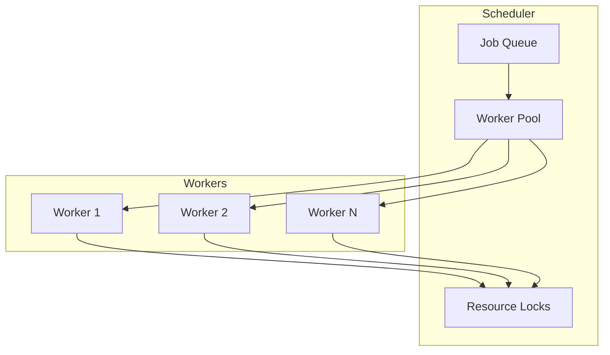
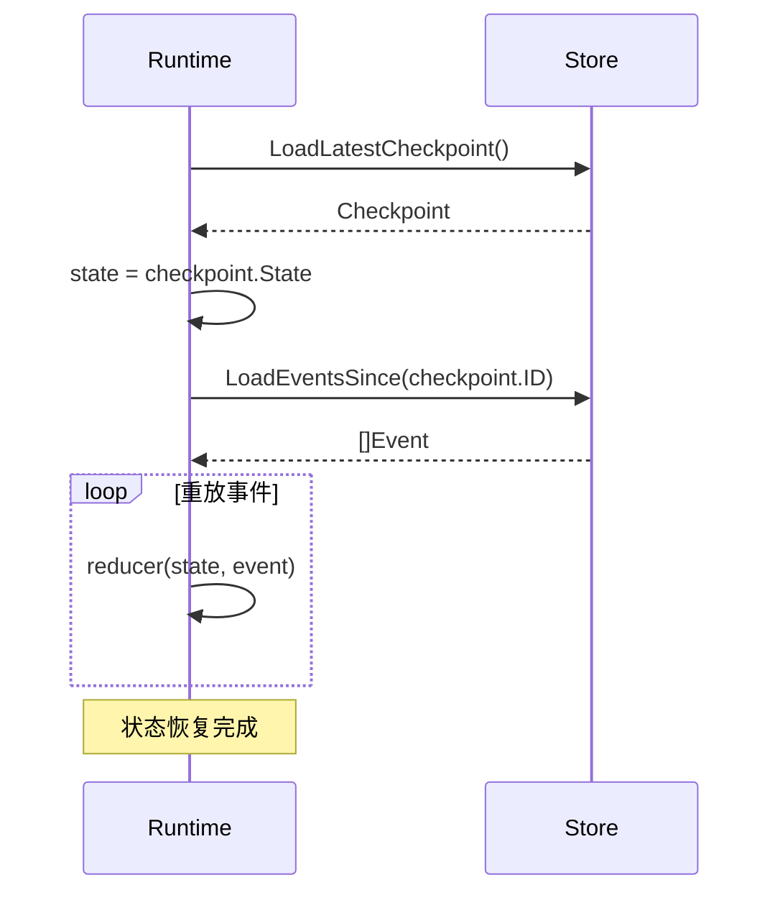
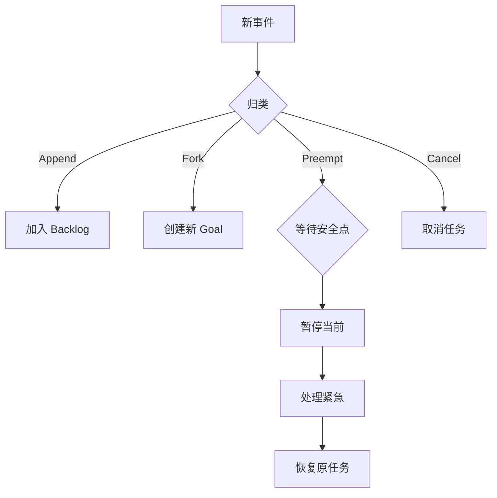

# 系统设计

> gm-agent 核心设计决策详解

---

## 1. 设计哲学

### 1.1 核心范式：事件驱动的 Durable Runtime



**关键点：**
- 状态转换是纯函数：`(state, event) -> (state, commands)`
- 副作用通过 Commands 隔离
- 任何时刻崩溃都可从持久化状态恢复

### 1.2 自主内核最小循环



| 阶段 | 职责 | 实现 |
| :--- | :--- | :--- |
| **Attention** | 从 Goal Stack 选择当前最重要目标 | Runtime |
| **Decide** | LLM 决定下一步动作 | LLM Gateway |
| **Act** | 派发工具调用/子 Agent | Dispatcher |
| **Observe** | 接收执行结果 | Event Handler |
| **Commit** | 持久化状态到安全点 | Checkpoint |

---

## 2. Reducer 模式

### 2.1 核心接口

> **数据模型权威来源**: 见 [data-model.md](./data-model.md)。

```go
// State/Event/Command 定义见 data-model.md
// Reducer 状态转换函数
type Reducer func(state *State, event Event) (*State, []Command, error)
```

### 2.2 事件类型

| 类型 | 描述 | 来源 |
| :--- | :--- | :--- |
| `UserMessage` | 用户输入 | CLI/API |
| `ToolResult` | 工具执行结果 | Tool Executor |
| `LLMResponse` | LLM 响应 | LLM Gateway |
| `SubTaskDone` | 子任务完成 | Sub Agent |
| `Checkpoint` | 安全点标记 | Runtime |
| `Interrupt` | 中断请求 | User/System |

### 2.3 命令类型

| 类型 | 描述 | 执行者 |
| :--- | :--- | :--- |
| `CallLLM` | 调用 LLM | LLM Gateway |
| `CallTool` | 调用工具 | Tool Executor |
| `SpawnSubTask` | 创建子任务 | Scheduler |
| `ApplyPatch` | 应用补丁 | Patch Engine |
| `SaveCheckpoint` | 保存检查点 | Store |

---

## 3. Dispatcher

### 3.1 职责



### 3.2 实现要点

```go
type Dispatcher struct {
    llm       *LLMGateway
    tools     *ToolExecutor
    scheduler *Scheduler
    patch     *PatchEngine
}

func (d *Dispatcher) Execute(ctx context.Context, cmd Command) ([]Event, error) {
    // 1. 检查 context 是否已取消
    if ctx.Err() != nil {
        return nil, ctx.Err()
    }
    
    // 2. 执行命令
    events, err := cmd.Execute(ctx, d.deps)
    if err != nil {
        return nil, err
    }
    
    // 3. 确保事件具备 ID（命令必须产出完整事件）
    for _, e := range events {
        if e.EventID() == "" {
            return nil, ErrMissingEventID // 返回缺失 ID 错误
        }
    }
    
    return events, nil
}
```

---

## 4. Scheduler

### 4.1 并发模型



### 4.2 资源锁设计

```go
// 单写多读策略
type LockManager struct {
    mu    sync.Mutex
    locks map[string]*Lock
}

type Lock struct {
    Resource string
    Owner    string
    Type     LockType // Read / Write
}

const (
    LockTypeRead  LockType = "read"
    LockTypeWrite LockType = "write"
)

func (lm *LockManager) AcquireWrite(resource, owner string) error {
    // 写锁：排他
    // 必须等待所有读锁释放
}

func (lm *LockManager) AcquireRead(resource, owner string) error {
    // 读锁：共享
    // 只需等待写锁释放
}
```

### 4.3 任务优先级

| 优先级 | 类型 | 行为 |
| :---: | :--- | :--- |
| 0 | **Preempt** | 在安全点抢占当前任务 |
| 1 | **High** | 优先调度 |
| 2 | **Normal** | 默认 |
| 3 | **Low** | 后台任务 |

---

## 5. Checkpoint 与恢复

### 5.1 安全点

```go
type Checkpoint struct {
    ID        string
    State     *State
    Timestamp time.Time
    Events    []Event // 自上次 checkpoint 以来的事件
}

func (r *Runtime) SaveCheckpoint(ctx context.Context) error {
    cp := &Checkpoint{
        ID:        generateCheckpointID(),
        State:     r.state.Clone(),
        Timestamp: time.Now(),
    }
    return r.store.SaveCheckpoint(cp)
}
```

### 5.2 恢复流程



---

## 6. 多请求者处理

### 6.1 输入归一化

所有输入统一为 Event：

```go
type UserEvent struct {
    EventID   string    // 幂等 ID
    Actor     string    // 发起者
    Subject   string    // 作用域 (workspace/doc)
    Priority  int       // 优先级
    Semantic  Semantic  // Append/Fork/Preempt/Cancel
    Content   string    // 内容
}

type Semantic string
const (
    SemanticAppend  Semantic = "append"   // 追加到当前目标
    SemanticFork    Semantic = "fork"     // 新建独立目标
    SemanticPreempt Semantic = "preempt"  // 紧急抢占
    SemanticCancel  Semantic = "cancel"   // 取消任务
)
```

### 6.2 冲突处理



---

## 7. Go 语言最佳实践

### 7.1 Context 传递

```go
// 所有异步操作都接受 context
func (e *ToolExecutor) Execute(ctx context.Context, call ToolCall) (Result, error) {
    select {
    case <-ctx.Done():
        return Result{}, ctx.Err()
    default:
    }
    
    // 执行工具...
}
```

### 7.2 Goroutine 管理

```go
type Runtime struct {
    wg     sync.WaitGroup
    cancel context.CancelFunc
}

func (r *Runtime) Shutdown() {
    r.cancel()           // 发送取消信号
    r.wg.Wait()          // 等待所有 goroutine 退出
    r.store.Close()      // 关闭存储
}
```

### 7.3 错误处理

```go
// 使用 Named Error 模式
type RuntimeError struct {
    Code    string
    Message string
    Cause   error
}

func (e *RuntimeError) Error() string {
    if e.Cause != nil {
        return fmt.Sprintf("[%s] %s: %v", e.Code, e.Message, e.Cause)
    }
    return fmt.Sprintf("[%s] %s", e.Code, e.Message)
}
```

---

## 8. 工程原则

| # | 原则 | 说明 |
| :---: | :--- | :--- |
| 1 | 控制流在 Runtime | LLM 只做决策，不控制流程 |
| 2 | 副作用走 Command | 纯函数 Reducer + 隔离副作用 |
| 3 | 写入必须可回滚 | Patch Flow: dry-run → apply → rollback |
| 4 | 单写多读 | 并发建议，串行写入 |
| 5 | 长任务可中断 | 安全点 + Checkpoint |
| 6 | 幂等设计 | event_id / job_id |
| 7 | 经验可固化 | Skills + Schemes |

---

## 下一步

- [Store 模块](../03-modules/store.md) - 存储层设计
- [LLM 模块](../03-modules/llm.md) - LLM Gateway 设计
- [安全架构](../06-security/README.md) - 密钥管理、权限控制
- [Runtime 模块](../03-modules/runtime.md)
- [数据模型](./data-model.md)
