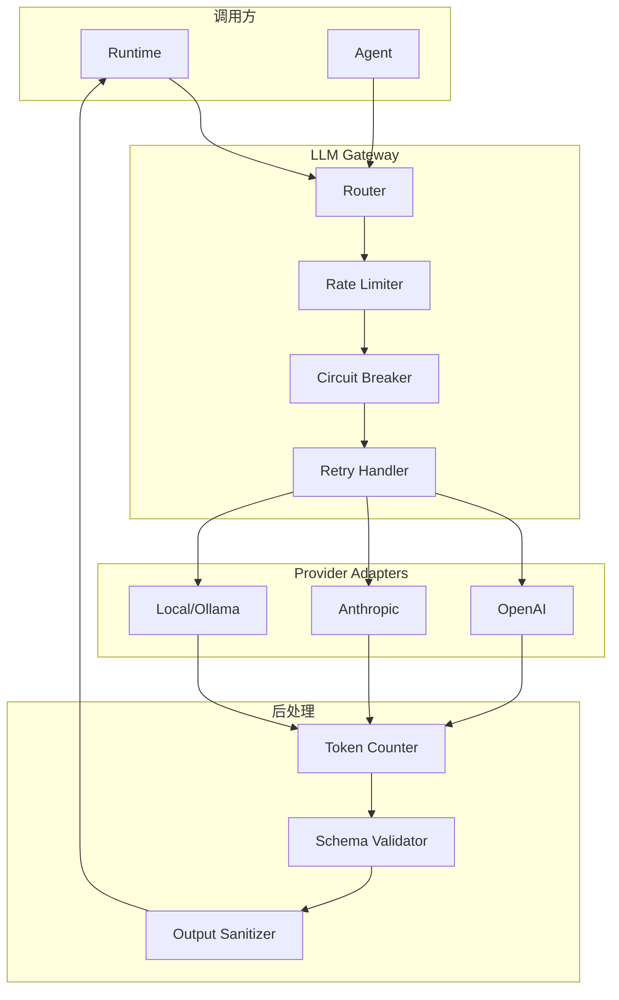

# 模块设计: LLM Gateway

> 多模型适配、流式处理、错误恢复的 LLM 调用层

---

## 1. 设计目标

| 目标 | 说明 |
| :--- | :--- |
| **多模型支持** | OpenAI / Anthropic / 本地模型 |
| **流式处理** | SSE 流式输出 + 中断处理 |
| **错误恢复** | 重试 / 熔断 / 降级 |
| **Token 管理** | 计数 / 预算 / 截断 |
| **结构化输出** | Schema 校验 / 修复 |

---

## 2. 架构设计



---

## 3. 核心接口

### 3.1 Gateway 接口

```go
package llm

import (
    "context"
    "io"
)

// Gateway LLM 网关接口
type Gateway interface {
    // 同步调用 (等待完整响应)
    Chat(ctx context.Context, req *ChatRequest) (*ChatResponse, error)
    
    // 流式调用 (返回流)
    ChatStream(ctx context.Context, req *ChatRequest) (Stream, error)
    
    // 结构化输出 (带 Schema 校验)
    ChatStructured(ctx context.Context, req *ChatRequest, schema Schema) (any, error)
    
    // 获取模型信息
    ModelInfo(modelID string) (*ModelInfo, error)
    
    // 健康检查
    Health(ctx context.Context) error
}

// Stream 流式响应接口
type Stream interface {
    // 接收下一个 chunk
    Next() (*StreamChunk, error)
    
    // 关闭流
    Close() error
    
    // 获取完整响应 (阻塞直到完成)
    Collect() (*ChatResponse, error)
}
```

### 3.2 请求/响应结构

```go
// ChatRequest 聊天请求
type ChatRequest struct {
    Model       string        `json:"model"`
    Messages    []Message     `json:"messages"`          // 见 data-model.md
    Tools       []Tool        `json:"tools,omitempty"`   // 见 data-model.md
    MaxTokens   int           `json:"max_tokens,omitempty"`
    Temperature float64       `json:"temperature,omitempty"`
    TopP        float64       `json:"top_p,omitempty"`
    Stop        []string      `json:"stop,omitempty"`
    
    // 内部字段
    RequestID   string        `json:"-"`
    Budget      *TokenBudget  `json:"-"`
}

// ChatResponse 聊天响应
type ChatResponse struct {
    ID           string      `json:"id"`
    Model        string      `json:"model"`
    Content      string      `json:"content,omitempty"`
    ToolCalls    []ToolCall  `json:"tool_calls,omitempty"`
    FinishReason string      `json:"finish_reason"`
    Usage        Usage       `json:"usage"`
}

// StreamChunk 流式块
type StreamChunk struct {
    Delta       string    `json:"delta"`
    ToolCall    *ToolCall `json:"tool_call,omitempty"`
    FinishReason string   `json:"finish_reason,omitempty"`
}
```

---

## 4. Provider Adapter

### 4.1 接口定义

```go
// Provider LLM 提供商适配器
type Provider interface {
    // 提供商 ID
    ID() string
    
    // 支持的模型列表
    Models() []ModelInfo
    
    // 调用 (同步)
    Call(ctx context.Context, req *ProviderRequest) (*ProviderResponse, error)
    
    // 调用 (流式)
    CallStream(ctx context.Context, req *ProviderRequest) (ProviderStream, error)
    
    // 计算 token 数 (估算)
    CountTokens(messages []Message) (int, error)
    
    // 格式化工具定义
    FormatTools(tools []Tool) any
    
    // 解析工具调用
    ParseToolCalls(response any) ([]ToolCall, error)
}
```

### 4.2 OpenAI 适配

```go
package openai

type OpenAIProvider struct {
    client *openai.Client
    config OpenAIConfig
}

type OpenAIConfig struct {
    APIKey     string `yaml:"api_key"`     // 从 SecretStore 获取
    BaseURL    string `yaml:"base_url"`    // 可选: 自定义端点
    OrgID      string `yaml:"org_id"`      // 可选: 组织 ID
    MaxRetries int    `yaml:"max_retries"` // 默认 3
}

func (p *OpenAIProvider) Call(ctx context.Context, req *ProviderRequest) (*ProviderResponse, error) {
    resp, err := p.client.CreateChatCompletion(ctx, openai.ChatCompletionRequest{
        Model:       req.Model,
        Messages:    convertMessages(req.Messages),
        Tools:       p.FormatTools(req.Tools).([]openai.Tool),
        MaxTokens:   req.MaxTokens,
        Temperature: float32(req.Temperature),
    })
    if err != nil {
        return nil, p.handleError(err)
    }
    return convertResponse(resp), nil
}

// 错误处理
func (p *OpenAIProvider) handleError(err error) error {
    var apiErr *openai.APIError
    if errors.As(err, &apiErr) {
        switch apiErr.HTTPStatusCode {
        case 429:
            return &RateLimitError{
                RetryAfter: parseRetryAfter(apiErr),
                Cause:      err,
            }
        case 500, 502, 503:
            return &RetryableError{Cause: err}
        case 401:
            return &AuthError{Cause: err}
        }
    }
    return &FatalError{Cause: err}
}
```

### 4.3 Anthropic 适配

```go
package anthropic

type AnthropicProvider struct {
    client *anthropic.Client
    config AnthropicConfig
}

func (p *AnthropicProvider) FormatTools(tools []Tool) any {
    // Anthropic 的工具格式不同于 OpenAI
    result := make([]anthropic.ToolDefinition, len(tools))
    for i, t := range tools {
        result[i] = anthropic.ToolDefinition{
            Name:        t.Name,
            Description: t.Description,
            InputSchema: t.Parameters, // JSON Schema
        }
    }
    return result
}

func (p *AnthropicProvider) ParseToolCalls(response any) ([]ToolCall, error) {
    // 解析 Anthropic 的 tool_use 格式
    content := response.([]anthropic.ContentBlock)
    var calls []ToolCall
    for _, block := range content {
        if block.Type == "tool_use" {
            calls = append(calls, ToolCall{
                ID:        block.ID,
                Name:      block.Name,
                Arguments: string(block.Input),
            })
        }
    }
    return calls, nil
}
```

---

## 5. 流式处理

### 5.1 SSE 流处理

```go
type SSEStream struct {
    reader  *bufio.Reader
    decoder *json.Decoder
    chunks  chan *StreamChunk
    err     error
    done    bool
    mu      sync.Mutex
}

func (s *SSEStream) Next() (*StreamChunk, error) {
    for {
        line, err := s.reader.ReadBytes('\n')
        if err != nil {
            if err == io.EOF {
                s.done = true
                return nil, io.EOF
            }
            return nil, err
        }
        
        // 解析 SSE 格式
        if bytes.HasPrefix(line, []byte("data: ")) {
            data := bytes.TrimPrefix(line, []byte("data: "))
            data = bytes.TrimSpace(data)
            
            if bytes.Equal(data, []byte("[DONE]")) {
                s.done = true
                return nil, io.EOF
            }
            
            var chunk StreamChunk
            if err := json.Unmarshal(data, &chunk); err != nil {
                continue // 跳过无法解析的行
            }
            return &chunk, nil
        }
    }
}

// 中断处理
func (s *SSEStream) Close() error {
    s.mu.Lock()
    defer s.mu.Unlock()
    s.done = true
    // 关闭底层连接
    return nil
}
```

### 5.2 流中断恢复

```go
// 流式调用包装器，支持超时检测
func (g *gateway) ChatStreamWithTimeout(ctx context.Context, req *ChatRequest, chunkTimeout time.Duration) (Stream, error) {
    stream, err := g.ChatStream(ctx, req)
    if err != nil {
        return nil, err
    }
    
    return &TimeoutStream{
        inner:        stream,
        chunkTimeout: chunkTimeout,
    }, nil
}

type TimeoutStream struct {
    inner        Stream
    chunkTimeout time.Duration
}

func (s *TimeoutStream) Next() (*StreamChunk, error) {
    done := make(chan struct{})
    var chunk *StreamChunk
    var err error
    
    go func() {
        chunk, err = s.inner.Next()
        close(done)
    }()
    
    select {
    case <-done:
        return chunk, err
    case <-time.After(s.chunkTimeout):
        s.inner.Close()
        return nil, &TimeoutError{Message: "chunk timeout"}
    }
}
```

---

## 6. 错误处理

### 6.1 错误分类

```go
// 错误类型
type ErrorType int

const (
    ErrorTypeRetryable ErrorType = iota  // 可重试
    ErrorTypeRateLimit                    // 速率限制
    ErrorTypeAuth                         // 认证错误
    ErrorTypeFatal                        // 致命错误
)

// 可重试错误
type RetryableError struct {
    Cause   error
    Attempt int
}

// 速率限制错误
type RateLimitError struct {
    RetryAfter time.Duration
    Cause      error
}

// 认证错误 (不重试)
type AuthError struct {
    Cause error
}

// 致命错误 (不重试)
type FatalError struct {
    Cause error
}
```

### 6.2 重试策略

```go
type RetryConfig struct {
    MaxRetries      int           `yaml:"max_retries"`       // 最大重试次数
    InitialBackoff  time.Duration `yaml:"initial_backoff"`   // 初始退避
    MaxBackoff      time.Duration `yaml:"max_backoff"`       // 最大退避
    BackoffMultiplier float64     `yaml:"backoff_multiplier"` // 退避倍数
}

var DefaultRetryConfig = RetryConfig{
    MaxRetries:        3,
    InitialBackoff:    time.Second,
    MaxBackoff:        30 * time.Second,
    BackoffMultiplier: 2.0,
}

func (g *gateway) callWithRetry(ctx context.Context, fn func() error) error {
    var lastErr error
    backoff := g.retryConfig.InitialBackoff
    
    for attempt := 0; attempt <= g.retryConfig.MaxRetries; attempt++ {
        err := fn()
        if err == nil {
            return nil
        }
        
        // 检查错误类型
        switch e := err.(type) {
        case *RetryableError:
            lastErr = err
            // 继续重试
            
        case *RateLimitError:
            // 等待指定时间后重试
            backoff = e.RetryAfter
            lastErr = err
            
        case *AuthError, *FatalError:
            // 不重试
            return err
            
        default:
            return err
        }
        
        // 等待退避时间
        select {
        case <-ctx.Done():
            return ctx.Err()
        case <-time.After(backoff):
            backoff = time.Duration(float64(backoff) * g.retryConfig.BackoffMultiplier)
            if backoff > g.retryConfig.MaxBackoff {
                backoff = g.retryConfig.MaxBackoff
            }
        }
    }
    
    return fmt.Errorf("max retries exceeded: %w", lastErr)
}
```

### 6.3 熔断器

```go
type CircuitBreaker struct {
    mu            sync.Mutex
    state         CircuitState
    failures      int
    threshold     int           // 失败阈值
    resetTimeout  time.Duration // 重置超时
    lastFailure   time.Time
}

type CircuitState int

const (
    StateClosed CircuitState = iota  // 正常
    StateOpen                         // 熔断
    StateHalfOpen                     // 半开
)

func (cb *CircuitBreaker) Allow() bool {
    cb.mu.Lock()
    defer cb.mu.Unlock()
    
    switch cb.state {
    case StateClosed:
        return true
        
    case StateOpen:
        // 检查是否超过重置超时
        if time.Since(cb.lastFailure) > cb.resetTimeout {
            cb.state = StateHalfOpen
            return true
        }
        return false
        
    case StateHalfOpen:
        return true
    }
    return false
}

func (cb *CircuitBreaker) RecordSuccess() {
    cb.mu.Lock()
    defer cb.mu.Unlock()
    
    cb.failures = 0
    cb.state = StateClosed
}

func (cb *CircuitBreaker) RecordFailure() {
    cb.mu.Lock()
    defer cb.mu.Unlock()
    
    cb.failures++
    cb.lastFailure = time.Now()
    
    if cb.failures >= cb.threshold {
        cb.state = StateOpen
    }
}
```

### 6.4 熔断行为表

| 状态 | `Allow()` 返回 | 请求行为 | 失败时 | 成功时 |
| :--- | :---: | :--- | :--- | :--- |
| **Closed** | `true` | 正常发送 | `failures++`，达到阈值则 → Open | 正常返回 |
| **Open** | `false` | 返回 `CircuitOpenError` | N/A | N/A |
| **HalfOpen** | `true` | 发送探测请求 | → Open | → Closed |

### 6.5 熔断打开时的返回值

```go
type CircuitOpenError struct {
    Provider    string
    OpenedAt    time.Time
    ResetAfter  time.Duration
}

func (e *CircuitOpenError) Error() string {
    return fmt.Sprintf("circuit breaker open for %s, reset in %v", 
        e.Provider, e.ResetAfter)
}

// 调用方检查熔断
func (g *gateway) Chat(ctx context.Context, req *ChatRequest) (*ChatResponse, error) {
    if !g.breaker.Allow() {
        return nil, &CircuitOpenError{
            Provider:   req.Model,
            OpenedAt:   g.breaker.lastFailure,
            ResetAfter: g.breaker.resetTimeout - time.Since(g.breaker.lastFailure),
        }
    }
    
    resp, err := g.doChat(ctx, req)
    if err != nil {
        g.breaker.RecordFailure()
        return nil, err
    }
    
    g.breaker.RecordSuccess()
    return resp, nil
}
```

### 6.6 降级链完整处理

```go
func (r *Router) Route(ctx context.Context, req *ChatRequest) (*ChatResponse, error) {
    tried := make(map[string]bool)
    models := append([]string{req.Model}, r.fallbacks[req.Model]...)
    
    var lastErr error
    for _, model := range models {
        if tried[model] {
            continue
        }
        tried[model] = true
        
        providerID, _ := parseModel(model)
        provider, ok := r.providers[providerID]
        if !ok {
            continue
        }
        
        // 检查熔断器
        breaker := r.breakers[providerID]
        if breaker != nil && !breaker.Allow() {
            lastErr = &CircuitOpenError{Provider: providerID}
            continue // 跳到下一个备选
        }
        
        // 尝试调用
        req.Model = model
        resp, err := provider.Call(ctx, req)
        if err == nil {
            if breaker != nil {
                breaker.RecordSuccess()
            }
            return resp, nil
        }
        
        if breaker != nil {
            breaker.RecordFailure()
        }
        lastErr = err
        
        // 如果是不可重试错误，立即返回
        if _, ok := err.(*AuthError); ok {
            return nil, err
        }
        if _, ok := err.(*FatalError); ok {
            return nil, err
        }
    }
    
    return nil, fmt.Errorf("all models failed, last error: %w", lastErr)
}
```

> [!IMPORTANT]
> **熔断器状态不持久化**
>
> 熔断器状态仅保存在内存中：
> - 重启后熔断器恢复为 Closed 状态
> - 这是有意设计：重启通常意味着环境变化，值得重新尝试
> - 如果需要跨重启保持熔断状态，可通过 Redis/外部存储扩展

## 7. Token 管理

### 7.1 Token 预算

```go
type TokenBudget struct {
    MaxInput      int `yaml:"max_input"`       // 输入上限
    MaxOutput     int `yaml:"max_output"`      // 输出上限
    MaxTotal      int `yaml:"max_total"`       // 总上限
    ReserveOutput int `yaml:"reserve_output"`  // 为输出预留
    
    // 运行时统计
    UsedInput  int
    UsedOutput int
}

func (b *TokenBudget) CanAdd(tokens int) bool {
    return b.UsedInput + tokens + b.ReserveOutput <= b.MaxTotal
}

func (b *TokenBudget) Remaining() int {
    return b.MaxTotal - b.UsedInput - b.ReserveOutput
}
```

### 7.2 上下文截断

```go
// 智能截断消息以适应 token 预算
func TruncateMessages(messages []Message, budget *TokenBudget, counter TokenCounter) []Message {
    // 1. 保护系统消息
    // 2. 保护最近的用户消息和最新响应
    // 3. 从中间删除旧消息
    // 4. 如果仍超出，截断长消息内容
    
    total := counter.Count(messages)
    if total <= budget.Remaining() {
        return messages
    }
    
    // 实现智能截断逻辑...
}
```

---

## 8. 结构化输出

### 8.1 Schema 校验

```go
// 请求结构化输出
func (g *gateway) ChatStructured(ctx context.Context, req *ChatRequest, schema Schema) (any, error) {
    // 将 schema 注入到 prompt
    req.Messages = append(req.Messages, Message{
        Role:    "user",
        Content: fmt.Sprintf("Respond ONLY with valid JSON matching this schema:\n%s", schema.JSON()),
    })
    
    resp, err := g.Chat(ctx, req)
    if err != nil {
        return nil, err
    }
    
    // 解析 JSON
    var result any
    if err := json.Unmarshal([]byte(resp.Content), &result); err != nil {
        // 尝试修复
        return g.attemptRepair(ctx, resp.Content, schema)
    }
    
    // 校验 schema
    if err := schema.Validate(result); err != nil {
        return g.attemptRepair(ctx, resp.Content, schema)
    }
    
    return result, nil
}
```

### 8.2 自动修复

```go
func (g *gateway) attemptRepair(ctx context.Context, malformed string, schema Schema) (any, error) {
    repairReq := &ChatRequest{
        Model: g.config.RepairModel,
        Messages: []Message{
            {Role: "system", Content: "Fix the following JSON to match the schema. Output ONLY valid JSON."},
            {Role: "user", Content: fmt.Sprintf("Schema:\n%s\n\nMalformed JSON:\n%s", schema.JSON(), malformed)},
        },
    }
    
    resp, err := g.Chat(ctx, repairReq)
    if err != nil {
        return nil, fmt.Errorf("repair failed: %w", err)
    }
    
    var result any
    if err := json.Unmarshal([]byte(resp.Content), &result); err != nil {
        return nil, fmt.Errorf("repair produced invalid JSON: %w", err)
    }
    
    return result, nil
}
```

---

## 9. 模型路由

```go
type Router struct {
    providers map[string]Provider
    fallbacks map[string][]string  // 主模型 -> 备选模型列表
}

func (r *Router) Route(ctx context.Context, req *ChatRequest) (*ChatResponse, error) {
    // 获取主 provider
    providerID, modelName := parseModel(req.Model)
    provider, ok := r.providers[providerID]
    if !ok {
        return nil, fmt.Errorf("unknown provider: %s", providerID)
    }
    
    // 尝试主模型
    resp, err := provider.Call(ctx, req)
    if err == nil {
        return resp, nil
    }
    
    // 如果是可恢复错误，尝试降级
    if _, ok := err.(*RetryableError); ok {
        for _, fallback := range r.fallbacks[req.Model] {
            req.Model = fallback
            providerID, _ := parseModel(fallback)
            if fp, ok := r.providers[providerID]; ok {
                if resp, err := fp.Call(ctx, req); err == nil {
                    return resp, nil
                }
            }
        }
    }
    
    return nil, err
}
```

---

## 10. 配置

```yaml
llm:
  # 默认模型
  default_model: "openai/gpt-4"
  
  # Provider 配置
  providers:
    openai:
      api_key: "${OPENAI_API_KEY}"  # 从环境变量
      max_retries: 3
    anthropic:
      api_key: "${ANTHROPIC_API_KEY}"
      max_retries: 3
  
  # 模型降级
  fallbacks:
    "openai/gpt-4": ["anthropic/claude-sonnet-4-20250514", "openai/gpt-3.5-turbo"]
    "anthropic/claude-sonnet-4-20250514": ["openai/gpt-4"]
  
  # Token 预算
  budget:
    max_input: 100000
    max_output: 4096
    reserve_output: 2048
  
  # 重试配置
  retry:
    max_retries: 3
    initial_backoff: 1s
    max_backoff: 30s
  
  # 熔断配置
  circuit_breaker:
    threshold: 5
    reset_timeout: 60s
```

---

## 11. 目录结构

```
pkg/llm/
├── gateway.go          # Gateway 接口
├── types.go            # 请求/响应类型
├── router.go           # 模型路由
├── retry.go            # 重试逻辑
├── circuit.go          # 熔断器
├── budget.go           # Token 预算
├── stream.go           # 流式处理
├── structured.go       # 结构化输出
├── providers/
│   ├── provider.go     # Provider 接口
│   ├── openai/
│   │   └── openai.go
│   ├── anthropic/
│   │   └── anthropic.go
│   └── local/
│       └── ollama.go
└── testing/
    └── mock.go
```
